## Scripts and folders

dataset\ - contains data for training.

debug\ - debug output of training. See NNDebugCallback.py
 
converter.py - script that takes `../../minimap/*_input.jpg`, apply to them `CMinimapRecognizer` and save results into `output` folder.

DataGenerator.py - data generator for training.

NNDebugCallback.py - callback for debugging the training process. Applies the current model to `debug\src_input.jpg` and save diffs between predicted masks and ground truth.

train.py - (for now) messy playground for training a neural network.

## History

[commit 63521f8c](https://github.com/GreenWizard2015/POE_bot/commit/63521f8cd91a86d5ef09fed9e71e0c373220c736) - hardcoded way for extracting minimap. 

---

[commit cc7c8808](https://github.com/GreenWizard2015/POE_bot/commit/cc7c88084a7a09db1b79e92c85e679b508afa2c5) - first neural network. I used the previous method for creating dataset (I fix masks manually). This network was very small (only 200 weights) and works pretty well, but I needed more precision and more than just maps contours. Later I found out that in Keras 2.1 was a bug and my DataGenerator return the same sample per training session :) I don't know how this network managed to return relevant output.

---

[commit fb5bad3e](https://github.com/GreenWizard2015/POE_bot/commit/fb5bad3e388146fc2898cb25cd94047efea31ee5) - very messy update. Many things were tried, fixed, rewritten, and thrown away.

As for now, the main task is extracting two binaries masks: "walls" and currently undiscovered areas. This is, essentially, a multi-labeled pixel-wise classification, so I decided that only CNN must be used. I take some tricks from U-Net, but drastically reduce complexity. Networks input is 64x64, because there is a very small dataset (if we have 64x64 input, then we can each sample split into 192*192 crops, which is more or less trainable). 

Steps of training:

1. Train modelA (`MRModel((64, 64), 2)`) to classify pixels of the "wall" and pixels of the "background".

2. Train modelB (`MRModel((64, 64), 2)`) to classify pixels of the "unknowns" and pixels of the "background".

3. Use modelA and modelB in `StackedMRModel` and train this network to split pixel into classes: background, wall and unknown/undiscovered.

Each model was trained for about 20 minutes on GeForce 1070 Ti.

Some example of predictions:

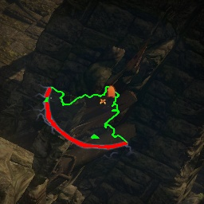 | 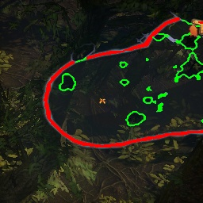
---: | ---:
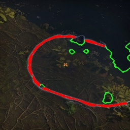 | 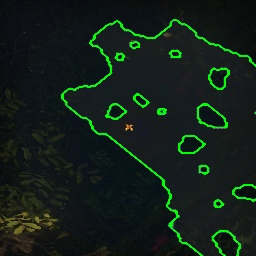

It seems almost perfect, but there are issues with flickering, noise and misclassification (i.e. any icons, waypoints, etc.). I think, that this is due to a small dataset, especially for icons.
 
---

[commit ba0c5097](https://github.com/GreenWizard2015/POE_bot/commit/ba0c509721af5109132aa204bb7da4b8c2be022a) - just added more samples and train again. Loss values weren't impressive, model B reach only ~0.4 scores, some samples recognize with artifacts, but in-game accuracy improved significantly.
 

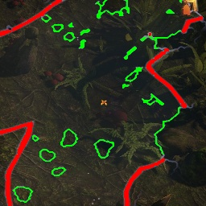 | 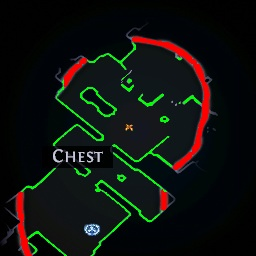
---: | ---:
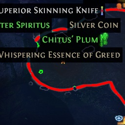 | 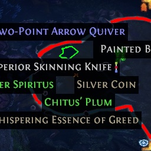

---

[commit 872063b2](https://github.com/GreenWizard2015/POE_bot/commit/872063b26f752d3ea61bcee80c6c4d33c6c879cb) - added simple images padding. I used cv2.BORDER_REFLECT, so it creating big variability of valid samples. I'm not using rotations and other typical augmentations, because it may damage minimap contours.

---

[commit 872063b2](https://github.com/GreenWizard2015/POE_bot/commit/872063b26f752d3ea61bcee80c6c4d33c6c879cb) - introduced "Weakness learning" algorithm. I can’t say for sure, but, at first glance, the speed of learning sometimes doubles. The accuracy is almost unchanged, but this is most likely because the network is too small. I do not want to increase complexity of the network because I am almost satisfied with the result. Also, the dataset is too small, which limits the possibilities for learning.

---

[commit 323b77c7](https://github.com/GreenWizard2015/POE_bot/commit/323b77c71a524bf84e3a0c5a186a808bf032eea8) - train the network for 256x256 input. Kinda milestone, because there are only 27 examples in the dataset with a size of 256 * 256 and you cannot get more examples by simple cropping. Paddings and reflections, however, might not give enough relevant examples.

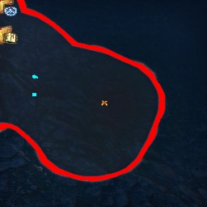 | 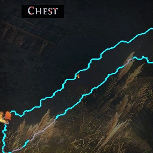
---: | ---:
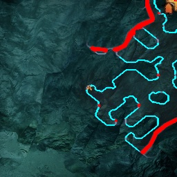 | 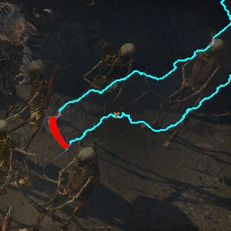

There were also more successful versions of the network, with fewer errors, but it is already playing with randomness. To further improve the work, it is necessary to expand the dataset and change architecture of the network. To further improve the work, it is necessary to expand the dataset and change the network architecture.